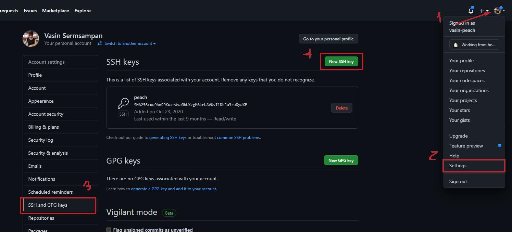

# Git tutorial (Pokemon World Demo)

> โปรเจกสำหรับฝึกใช้งาน git พื้นฐาน

<!-- TABLE OF CONTENTS -->
<details open="open">
  <summary>Table of Contents</summary>
  <ol>
    <li>
      <a href="#installation">Installation</a>
    </li>
    <li>
      <a href="#authorization">Authorization</a>
      <ul>
        <li>
          <a href="#add-key-page">Add Key Page</a>
        </li>
         <li>
          <a href="#copy-public-key">Copy Public Key</a>
        </li>
      </ul>
    </li>
     <li>
      <a href="#basic-command-pattern">Basic Command Pattern</a>
      <ul>
        <li>
          <a href="#git-clone">Git Clone</a>
        </li>
        <li>
          <a href="#git-pull">Git Pull</a>
        </li>
         <li>
          <a href="#git-status">Git Status</a>
        </li>
         <li>
          <a href="#git-commit">Git Commit</a>
        </li>
        <li>
          <a href="#git-push">Git Push</a>
        </li>
      </ul>
    </li>
    <li>
      <a href="#basic-branch">Basic Branch</a>
      <ul>
        <li>
          <a href="#add-key-page">Git branch</a>
        </li>
         <li>
          <a href="#copy-public-key">Copy Public Key</a>
        </li>
      </ul>
    </li>
  </ol>
</details>

# [Installation](readme.md#installation)

- [Download](https://git-scm.com/download/win) และติดตั้ง git
- เมื่อติดตั้งเสร็จ git จะถูกเพิ่มเข้าไปในระบบและสามารถเข้าถึงได้ผ่าน terminal ต่างๆ [CMD, Powershell, Etc.]

# [Authorization](readme.md#authorization)

> ขั้นตอนต่อไปจะเป็นการเข้าสู่ระบบ git โดยใช้ ssh หรือถ้าใช้ gitlab สามารถ login ด้วย user, pass ได้เลยเมื่อ clone แต่ในที่นี้จะสอนการเข้าสู่ระบบโดยใช้ ssh

## Add Key Page

> เข้าไปยังหน้า add key ใน gitlab หรือ github




## Copy Public Key

> Copy public key จากเครื่องของเราโดยให้ไปยัง Home directory และเข้าไปโฟลเดอร์ .ssh สำหรับบางคนอาจจะไม่เห็นโฟลเดอร์นี้เพราะจะถูกซ่อนไว้ ให้ทำการ maunual path หรือ cd เข้าไป

```cmd
C:\Users\{ยูสเซอร์เรา}\.ssh\id_rsa.pub
```

- หน้าตาของ public key จะขึ้นต้นด้วย ssh-rsa ... ดั่งภาพ
  

- ให้ทำการคัดลอก public key และไปวางยัง gitlab ในขั้นตอนที่ 2.1
  
- เท่านี้เราก็จะสามารถเข้า repository ได้เหมือนกับที่ account gitlab, github เราโดยไม่ต้อง login ทุกครั้ง

# [Basic Command Pattern](readme.md#basic-command-pattern)

> ในการใช้งานทั่วไปจะมี pattern ของคำสั่ง 5 [clone, pull, add, commit, push] ดังนี้

## Git Clone

> คำสั่งสำหรับการ download repository โดยใช้ url จาก project, ในที่นี้เราสามารถใช้ url จาก ssh, https ก็ได้

```bash
$ git clone {url}
```


## Git Pull

> คำสั่งสำหรับดึง `commit` ล่าสุดจาก git server(remote) เพื่อให้ local ของเราเป็น `version` ล่าสุดเหมือนบน remote

> ถ้าต้องการแค่เช็คความเปลี่ยนแปลงบน remote แต่ไม่ต้องการดึงลงมาให้ใช้คำสั่ง `git fetch` ก่อนก็ได้เพื่อเช็คการเปลี่ยนแปลง

> \*\*ควรทำขั้นตอนนี้ทุกครั้งก่อนเริ่มทำงานเพื่อให้ local เราเป็น version ปัจจุบันเสมอ เพื่อหลีกเลี่ยงการ `conflict` จากการที่ version ไม่ใช่ล่าสุดแล้วเราไปแก้ code ที่เคยแก้ไปแล้ว

```bash
$ git pull # pull branch ที่เราอยู่
$ git pull origin {branch} # pull branch ที่ต้องการ
```

### Git Status

> คำสั่งสำหรับเช็คสถาณะไฟล์ของ project โดยเมื่อใช้คำสั่งนี้ git จะแสดงรายการของไฟล์ใน project เราว่าอยู่ในสถาณะใด

```bash
$ git status
```


> สีแดง คือยังไม่ได้ add

> สีเขียว คือ add แล้ว

## Git Add

> คำสั่งสำหรับเพิ่ม(add) ไฟล์ที่ต้องการ โดยเมื่อ add แล้วสถาณะของไฟล์จะถูกเปลี่ยนเป็นสีเขียว

```bash
$ git add . #หมายถึงเพิ่มทั้งหมด
$ git add index.html
$ git add images/01.jpg
```

## Git Commit

> คำสั่งสำหรับ commit ไฟล์ทั้งหมดที่เราเพิ่ม(add) ไปก่อนหน้านี้ โดยจะเป็นการใส่คำอธิบายว่าสิ่งที่เรา add ไปว่าเราทำอะไรไปบ้างเช่น เพิ่ม feature, แก้ไข bug

```bash
$ git commit -m "ข้อความ"
```

> -m คือแทรก message ผ่าน command แทนที่จะใช้ editor

## Git Push

> คำสั่งสำหรับ push ขึ้นไปยัง git server(remote), ในขั้นตอนก่อนหน้านี้การ commit จะเป็นการทำใน local หรือเครื่องเราเท่านั้น เราจึงจำเป็นต้อง push local ขึ้น remote เพื่อให้คนอื่นเห็นสิ่งที่เราดำเนินการไป\

```bash
$ git push #ในกรณีที่ remote มี branch ที่จะ push แล้ว
```

> กรณีที่เราสร้าง branch ใหม่แล้ว branch นั้นยังไม่ได้มีอยู่บน remote server จำเป็นต้องตั้ง `upstream` ก่อนเพื่อทำการเชื่อม branch `local` ไปยัง `remote server`

```bash
$ git push -u origin {ชื่อ branch}
$ git push --set-upstream origin {ชื่อ branch} #คำสั่งเดียวกับด้านบน แค่เป็นคำสั่งเต็ม
```

# [Basic Branch](readme.md#basic-branch)


Branch เปรียบได้เหมือนการแบ่ง version ของโค้ดเป็นเอกเทศออกจากกัน ทำให้เราสามารถจัดการกับโค้ดได้สดวกสบายมากยิ่งขึ้น

เช่น นาย `A,B,C ` กำลังสร้างเกมโปเกมอน ซึ่งต่างต้องทำงานในไฟล์เดียวกัน แต่คนละฟีเจอร์กัน แต่ละคนจะแตก branch ออกมาจาก branch หลักเป็น feature ที่ตัวเองทำ เช่น branch `attack`, `defend`, `item` ด้วยวิธีนี้ทำให้แต่ละคนสามารถทำงานของตนพร้อมกับคนอื่นได้ โดยที่ไม่ต้องไปยุ่งกับโค้ดของแต่ละคน

เมื่อแต่ละคนทำฟีเจอร์ของตนเองเสร็จแล้ว จะทำการ `merge` ขึ้นไปยัง branch ต้นทางจากที่แตกมาซึ่งก็คือเกมโปเกมอนนั่นเอง

## Git Branch

```bash
$ git branch #ดู local branches
$ git branch {ชื่อ branch} #สร้าง branch แต่ยังไม่ได้ checkout
$ git branch -r #ดู remote branches
$ git branch -a #ดู branches ทั้งหมด
$ git branch -D {ชื่อ branch} #ลบ branch
```

## Git Checkout

> คำสั่งสำหรับเปลี่ยน branch ไปยัง branch ที่เราต้องการ

```bash
$ git checkout {ชื่อ branch} #เปลี่ยน branch ที่มีอยู่ใน local เรา
$ git checkout -b {ชื่อ branch} #สร้าง branch ใหม้พร้อม checkout ไปยัง branch นั้น
$ git checkout --track origin/{ชื่อ branch} #เปลี่ยน branch ไปยัง branch ที่อยู่บน remote
```

> กรณีที่เราสร้าง branch ใหม่แล้ว branch นั้นยังไม่ได้มีอยู่บน remote server จำเป็นต้องตั้ง `upstream` ก่อนเพื่อทำการเชื่อม branch `local` ไปยัง `remote server` [ดูที่นี่](readme.md#git-push)

## Git Merge

> คำสั่งสำหรับร่วม branch ที่เราอยู่กับ branch เป้าหมาย

> เราต้อง checkout branch ก่อนแล้วค่อย merge กับ branch เป้าหมาย

> ตัวอย่างเช่นเราอยาก merge branch `item` เข้ากับ `master` เราจะ checkout ที่ `master` ก่อนหลังจากนั้นจึงพิมคำสั่ง `git merge item`

```bash
$ git merge {ชื่อ branch เป้าหมาย}
```
